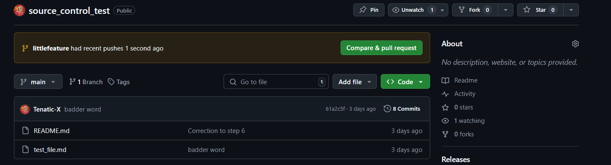
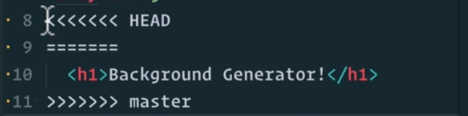

# source_control_test
Tonight, I'm learning how to use source control from github.
It's like a google docs, where people access the same file, and make changes together in real time.

Difference is, the changes from person A, and person B may be conflicting to the script. The source control aims to be the middle man, having both A and B discuss amongst themselves to find the compromise with the changes, and get the same resulting codes.

1. Click the green '**<>code**' button, and copy the link for '**https**'.
2. In command prompt, go to your correct file directory, and write `git clone https://github.com/Tenatic-X/source_control_test.git` It creates a folder with this `README` file, and has a hidden folder where github communicates with the computer.
3. Change directory to the source control folder github created, and type `git status` shows whether the file is not the same in github.
4. Use `git add (filename)` to add the files you've edited/changed on your computer in the source control folder, into the repository. P.S. Use `git add .` to add all file changes
5. Use `git commit` to commit that the changes you've made is published into the github repository. `git commit -m 'this place adds a message for the changes you've made'`
6. Use `git push` to push the changes you've made into the actual repository. The changes can be seen on the '**history**' tab for a specific file.
7. Use `git pull` pulls the current github repository into your current computer files. Whenever updates happen on the repository, you can get its latest version by pulling it in.

## Source_control branches
The thing with source_control, is it's constantly edited. It's important the changes instantiated in the repo, doesn't affect the master branch, where it's immediately applied to all users, whos relying on the repo. But you have separate branches to store your edited versions, to run proper tests and checks, before fulling releasing the code.

1. Do steps 1 to 3 from previous chunk.
2. Use `git branch` to check what branches you have for your repo.
3. Use `git branch branchname`, and 'branchname' is the name for your new branch on the repo. You can check again with `git branch`.
4. Use `git checkout branchname`, to switch github branch to the name of the branch you want.
5. Do steps 4-6 from previous chunk. New branch should show up on your repo.

6. Click on compare and pull request, where you can add more details as to what changes you've made, and communicate it with your colleagues.
7. If you're on the recieving end, you can review the code changes, and leave a message on your thoughts of the changes.
8. If you're all on agreement with the code, it can then be chosen to be merged with the master branch. The secondary branch can also be deleted if not in use anymore.
9. Use `git merge branchname`, to merge another separate branch with the branch you are currently working on.

10. You get something like the above. `HEAD` is your current branch, `master` is the name of the branch, merging. Communicate with your colleagues on the changes, and edit out the `HEAD` and `master`.
